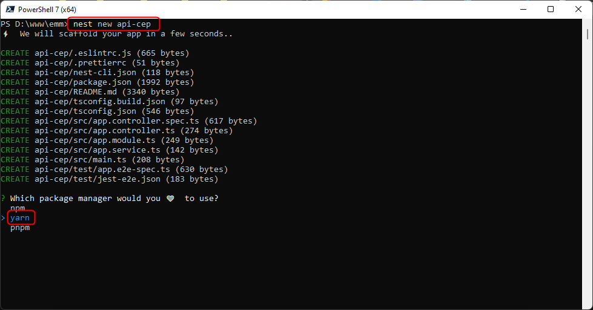

#### Aula 01 - Criação de uma API em NodeJS utilizando framework NestJS

---

## Framework

> Importante

- Uma estrutura que serve de base para a construção de aplicações.
- Construir sites, aplicativos e softwares a partir de um esqueleto pré-definido.

---

## Framework

> Exemplo

```js
@Resolver(() => Cliente)
export class ClienteResolver {
  constructor(private readonly clienteService: ClienteService) { }

  @Query(() => Cliente, { nullable: true })
  async clienteByCPF(@Args('cpf') cpf: string): Promise<Cliente> {
    return await this.clienteService.getByCPF(cpf);
  }
}
```

---

## NodeJS

> Importante

Nem linguagem, nem framework: Node.js é um runtime de JavaScript que leva a renderização e processamento do código JavaScript para o lado do servidor, desvinculando-o totalmente do browser.

---

## O que é o NestJS?

Framework **back-end** que auxilia o desenvolvimento de aplicações eficientes, escaláveis e confiáveis em cima do **NodeJS**.

---

## O que é o NestJS?

- O NestJS utiliza como padrão **TypeScript** e possui uma sintaxe parecida com **Angular**.<br /><br />
- O NestJS também utiliza o **Express** "por baixo dos panos".

---

## Instalação do NodeJS

[Instalador](https://nodejs.org/en/)

---

## Instalação do Yarn

```
npm install --global yarn
```

---

## Instalação do NestJS

```
npm i -g @nestjs/cli
```

---

## Iniciando o Projeto

```
nest new api-cep
```

---



---

## Acessando o projeto

```
cd api-cep
code .
```

---

## Com o Terminal aberto no VSCode, executar.

```
yarn start
```

---

```
$ nest start
[Nest] 9852  - 12/07/2022 20:48:54     LOG [NestFactory] Starting Nest application...
[Nest] 9852  - 12/07/2022 20:48:54     LOG [InstanceLoader] AppModule dependencies initialized +23ms
[Nest] 9852  - 12/07/2022 20:48:54     LOG [RoutesResolver] AppController {/}: +4ms
[Nest] 9852  - 12/07/2022 20:48:54     LOG [RouterExplorer] Mapped {/, GET} route +3ms
[Nest] 9852  - 12/07/2022 20:48:54     LOG [NestApplication] Nest application successfully started +2ms
```

---

Acessar:

[http://localhost:3000](http://localhost:3000)

---

## Criando um module / controller / service

> Executar o comando `nest`

```
nest g mo cep
nest g co cep
nest g s cep
```

## Install AXIOS

```
yarn add @nestjs/axios
```
