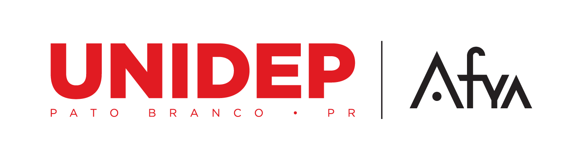

---

#### Tecnologia em Análise e Desenvolvimento de Sistemas

<br>

- Disciplina: Programação Web
- Professor: Eduardo Malherbi Martins

---

#### Objetivo

Introduzir o aluno ao desenvolvimento de APIs em servidores Web, utilizando a arquitetura REST. Aplicação do framework NestJS um dos principais framework para desenvolvimento de software de grandes empresas.

---

#### Aplicabilidade prática

O sistema de ERP da UNIDEP necessita consultar a nossa API de **consulta CEP** desenvolvida em aula para realizar o cadastro dos ingressos nos cursos da instituição.

---


#### Criação de uma API em NodeJS utilizando framework NestJS

---

#### Framework

> Importante

- Uma estrutura que serve de base para a construção de aplicações.
- Construir sites, aplicativos e softwares a partir de um esqueleto pré-definido.

---

#### Framework

> Exemplo

```ts
@Resolver(() => Cliente)
export class ClienteResolver {
  constructor(private readonly clienteService: ClienteService) {}

  @Query(() => Cliente, { nullable: true })
  async clienteByCPF(@Args("cpf") cpf: string): Promise<Cliente> {
    return await this.clienteService.getByCPF(cpf);
  }
}
```

---

#### NodeJS

> Importante

Nem linguagem, nem framework: Node.js é um runtime de JavaScript que leva a renderização e processamento do código JavaScript para o lado do servidor, desvinculando-o totalmente do browser.

---

#### O que é o NestJS?

Framework **back-end** que auxilia o desenvolvimento de aplicações eficientes, escaláveis e confiáveis em cima do **NodeJS**.

---

#### O que é o NestJS?

- O NestJS utiliza como padrão **TypeScript** e possui uma sintaxe parecida com **Angular**.<br /><br />
- O NestJS também utiliza o **Express** "por baixo dos panos".

---

#### Instalação do NodeJS

[Instalador](https://nodejs.org/en/)

---

#### Instalação do Yarn

```bash
npm install --global yarn
```

---

#### Instalação do NestJS

```bash
npm i -g @nestjs/cli
```

---

#### Iniciando o Projeto

```bash
nest new api-cep
```

---


---

#### Acessando o projeto

```bash
cd api-cep
code .
```

---

#### Com o Terminal aberto no VSCode, executar.

```bash
yarn start
```

---

```bash
$ nest start
[Nest] 9852  - 12/07/2022 20:48:54     LOG [NestFactory] Starting Nest application...
[Nest] 9852  - 12/07/2022 20:48:54     LOG [InstanceLoader] AppModule dependencies initialized +23ms
[Nest] 9852  - 12/07/2022 20:48:54     LOG [RoutesResolver] AppController {/}: +4ms
[Nest] 9852  - 12/07/2022 20:48:54     LOG [RouterExplorer] Mapped {/, GET} route +3ms
[Nest] 9852  - 12/07/2022 20:48:54     LOG [NestApplication] Nest application successfully started +2ms
```

---

Acessar:

[http://localhost:3000](http://localhost:3000)

---

#### Criando um module / controller / service

> Executar o comando `nest`

```bash
nest g mo cep
nest g co cep
nest g s cep
```

---

#### Install AXIOS

```bash
yarn add @nestjs/axios
```

---

#### Service

```ts
import { HttpService } from "@nestjs/axios";
import { Injectable } from "@nestjs/common";
import { lastValueFrom } from "rxjs";

@Injectable()
export class CepService {
  constructor(private readonly httpService: HttpService) {}

  async consultaCep(cep: string) {
    try {
      const response = this.httpService.get(
        `https://viacep.com.br/ws/${cep}/json/`
      );
      const { data } = await lastValueFrom(response);

      return data;
    } catch (error) {
      throw new Error(`Erro ao consultar o cep: ${error}`);
    }
  }
}
```

---

#### Controller

```ts
@Controller("/api/cep")
export class CepController {
  constructor(private readonly cepService: CepService) {}

  @Get(":cep")
  public async getCep(@Param("cep") cep: string): Promise<any> {
    return this.cepService.consultaCep(cep);
  }
}
```

---

#### Module

```ts
@Module({
  imports: [HttpModule],
  controllers: [CepController],
  providers: [CepService],
})
export class CepModule {}
```

---

# Dúvidas?
